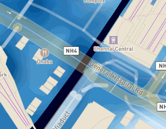

## floodmap.io

Please note: this is alpha software, so bear with us. We hope it will be useful to communities impacted by flooding and will do our best to refine things as we collect feedback.

Interactive map to visualize and crowdsource flood related information using [OpenStreetMap](http://www.openstreetmap.org/) and [Mapbox GL JS](https://www.mapbox.com/mapbox-gl-js/). Read more in the press

- [GIM](https://www.gim-international.com/content/news/crowdsourced-mapping-projects-aid-post-harvey-disaster-management)
- [CBS](https://www.cbsnews.com/news/houston-harvey-u-flood-maps/?ftag=CNM-00-10aab6a&linkId=41670697)
- [CNET](https://www.cnet.com/news/maps-of-houstons-floods-shows-its-worse-than-you-thought-hurricane-harvey/)
- [Mashable](http://mashable.com/2017/08/30/crowdsource-map-u-flood-tracks-harvey-flooding/#WWljEZGHGmqF)
- [Weather Underground](https://www.wunderground.com/cat6/harvey-houston-most-extreme-rains-ever-major-us-city)
- [Times of India](http://timesofindia.indiatimes.com/tech/apps/Bangalore-techies-build-app-to-help-Chennai-flood-victims/articleshow/50039041.cms)
- [The Hindu](http://www.thehindu.com/news/cities/chennai/crowdsourced-map-to-mark-inundated-areas/article7935008.ece)

### How-to
Simply click/tap on a road segment to mark it as flooded or cleared. Reporting works above zoom level 14. The higher the level, the more zoomed in you are. You can view the map's current zoom level in your browser's address bar at any time; it's the first number after your city's name. For example, the URL https://floodmap.io/miami/#14/25.7700/-80.1900 is at zoom level 14.

We rely on users to maintain the accuracy of flood reports. Please do your part, especially once roads have dried out.

### Missing streets
If your street, building or neighborhood name is missing on the map, you can add it to the basemap directly by editing [OpenStreetMap](http://tasks.openstreetmap.us/). The flood map will be updated with the new street in under 10 minutes.

### Flooded Streets Data
The flooded streets layer is contributed by the public. Contributions are anonymous with no version control for the sake of simplicity.

#### Data Archive
You are encouraged to make use of the collected data for further analysis. Download the latest flooded streets layer as a GeoJSON using [this script](https://github.com/tailwindlabs/flood-map/blob/master/snapshot/uflood-snapshot.py).

Weather Tactics has made hourly snapshots available via Dropbox

- [Hurricane Irma](https://www.dropbox.com/sh/7choc4mv1o1fn2z/AACbqlw5mDvPLQLGwGBJt_oUa?dl=0)
- [Hurricane Harvey](https://www.dropbox.com/sh/525vvot1fe56941/AABRuDQF9qqHs-7B4GNDAdxTa?dl=0)

### Data Sources
- **Base Layer** - [OpenStreetMap](http://openstreetmap.org)

#### Sources
- [HTML5 boilerplate](https://github.com/h5bp/html5-boilerplate)
- [Mapbox base.css](https://www.mapbox.com/base/)
